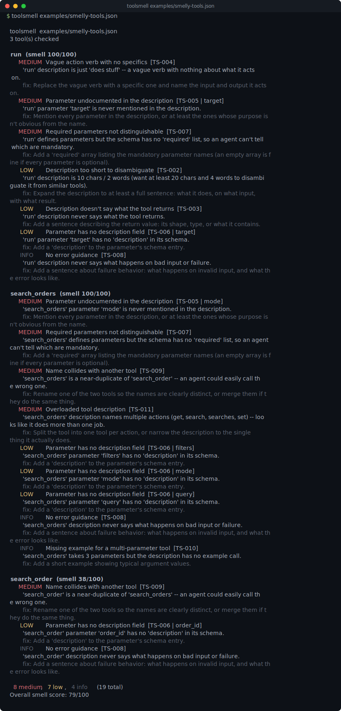

# toolsmell

[](https://github.com/munzzyy/toolsmell/actions/workflows/ci.yml)
[](LICENSE)
[](pyproject.toml)



That's toolsmell run against [`examples/smelly-tools.json`](examples/smelly-tools.json),
three tools handpicked to each trip a different smell: a description that's
just "does stuff," a `search_orders` tool whose description tries to cover
six jobs at once, and a `search_order`/`search_orders` pair an agent could
easily call the wrong one of.

toolsmell is a static linter for MCP tool definitions: point it at a
server's `tools/list` output and it flags description and JSON Schema
smells that make an agent pick the wrong tool or call it wrong. It never
runs anything and never talks to a server or the network -- it just reads
the manifest.

## Why

A 2026 study, arXiv:2602.14878 ("MCP Tool Descriptions Are Smelly!"), found
that fixing description quality measurably improves agent task success on
MCP tool calls. That finding is what motivated this tool. The rule set
below is toolsmell's own, not lifted from the paper.

```
$ toolsmell examples/weather-tool-smelly.json --no-color

  toolsmell  examples/weather-tool-smelly.json
  1 tool(s) checked

  get_weather  (smell 100/100)
    MEDIUM  Vague action verb with no specifics  [TS-004]
          'get_weather' description is just 'Handles requests.' -- a vague verb with nothing about what it acts on.
          fix: Replace the vague verb with a specific one and name the input and output it acts on.
    MEDIUM  Parameter undocumented in the description  [TS-005 | location]
          'get_weather' parameter 'location' is never mentioned in the description.
          fix: Mention every parameter in the description, or at least the ones whose purpose isn't obvious from the name.
    MEDIUM  Parameter undocumented in the description  [TS-005 | units]
          'get_weather' parameter 'units' is never mentioned in the description.
          fix: Mention every parameter in the description, or at least the ones whose purpose isn't obvious from the name.
    MEDIUM  Required parameters not distinguishable  [TS-007]
          'get_weather' defines parameters but the schema has no 'required' list, so an agent can't tell which are mandatory.
          fix: Add a 'required' array listing the mandatory parameter names (an empty array is fine if every parameter is optional).
     LOW    Description too short to disambiguate  [TS-002]
          'get_weather' description is 17 chars / 2 words (want at least 20 chars and 4 words to disambiguate it from similar tools).
          fix: Expand the description to at least a full sentence: what it does, on what input, with what result.
     LOW    Description doesn't say what the tool returns  [TS-003]
          'get_weather' description never says what the tool returns.
          fix: Add a sentence describing the return value: its shape, type, or what it contains.
     LOW    Parameter has no description field  [TS-006 | location]
          'get_weather' parameter 'location' has no 'description' in its schema.
          fix: Add a 'description' to the parameter's schema entry.
     LOW    Enum-worthy free text  [TS-012 | units]
          'get_weather' parameter 'units' spells out allowed values in prose ("Either 'metric', 'imperial', or 'standard'.") instead of using a schema enum.
          fix: Add an 'enum' listing the allowed values to the parameter's schema instead of describing them in prose.
     INFO   No error guidance  [TS-008]
          'get_weather' description never says what happens on bad input or failure.
          fix: Add a sentence about failure behavior: what happens on invalid input, and what the error looks like.

  4 medium, 4 low, 1 info   (9 total)
  Overall smell score: 100/100
```

Fix the description and schema (see [`examples/weather-tool-clean.json`](examples/weather-tool-clean.json)) and the same tool comes back clean:

```
$ toolsmell examples/weather-tool-clean.json --no-color

  toolsmell  examples/weather-tool-clean.json
  1 tool(s) checked

  get_weather  (smell 0/100)
    no smells found

  0 smells   (0 total)
  Overall smell score: 0/100
```

## Install

Pure standard library, Python 3.9+, no runtime dependencies. Clone it and it runs:

```bash
git clone https://github.com/munzzyy/toolsmell
cd toolsmell
python -m toolsmell ./tools.json      # run it directly, no install
pip install -e .                      # or install the `toolsmell` command
```

Once it's on PyPI: `pipx install toolsmell`.

## Usage

```bash
toolsmell ./tools.json              # a {"tools": [...]} manifest, the shape tools/list returns
toolsmell ./tools.json --json       # machine-readable output
toolsmell ./tools.json --max-score 30   # tighten the failing threshold (default 50)
toolsmell --list-rules              # print every rule id and exit
```

`--max-score N` fails the run (exit 1) if the overall smell score is at or
above `N`. That's the whole CI story:

```yaml
- run: pipx run toolsmell ./tools.json --max-score 30
```

## Getting the manifest

toolsmell only reads a static `tools/list` response -- a JSON file shaped
`{"tools": [...]}`. Most MCP servers define their tools in code, not as a
file sitting on disk, so there's usually no `tools.json` lying around to
point at. Call the server's `tools/list` method once and save what comes
back, or paste the tools array into a file by hand -- either way, once it's
JSON on disk, toolsmell can lint it.

## pre-commit

You can run `toolsmell` as a [pre-commit](https://pre-commit.com/) hook. Add this to your `.pre-commit-config.yaml`:

```yaml
repos:
  - repo: https://github.com/munzzyy/toolsmell
    rev: v0.1.0  # replace with the latest version
    hooks:
      - id: toolsmell
        # You can override the files regex to match your manifest
        # files: ^tools.*\.json$
```
By default, the hook matches files with `.*tools.*\.json$`.

## What it checks

See the [Rules Reference](docs/rules.md) for the full detail on each rule,
its severity, and how to fix it.

- Missing, empty, or too-short descriptions.
- Descriptions that never say what the tool returns.
- A bare vague verb ("process", "handle", "manage", "do") with no
  specifics.
- Schema parameters the description never mentions.
- Schema parameters with no `description` of their own.
- Parameters present but no `required` list to say which are mandatory.
- Descriptions that never say what happens on bad input.
- Tool names that are near-duplicates of another tool in the same manifest.
- Multi-parameter tools with no example call.
- Descriptions that list several unrelated actions (probably two tools
  wearing one name).
- String parameters whose description spells out allowed values in prose
  instead of a schema `enum`.

## What it does not do

- It's a static linter, not a security scanner. It never looks for prompt
  injection, dangerous commands, or secrets -- that's a different tool's job.
- It's not a runtime tester. It never calls the tool, never talks to the
  MCP server, and never touches the network.
- It only reads the shape `tools/list` returns: a JSON file with a `tools`
  array of `{name, description, inputSchema}`. A Python file exporting a
  tool list is out of scope -- export it to JSON first.
- The severities and thresholds are toolsmell's own judgment calls, not a
  formula from the paper that motivated it. Tune `--max-score` to your
  server; a clean score means nothing obvious tripped, not that the
  description is great prose.

## Exit codes

- `0` -- the overall smell score is under `--max-score` (default 50).
- `1` -- the score is at or above `--max-score`.
- `2` -- usage error: no target given, the file doesn't exist, or it isn't
  a valid tools manifest.

## Contributing

Found a smell that should have been flagged and wasn't, or a false
positive? Open an issue with the smallest manifest that reproduces it. New
rules land with a fixture in `tests/corpus/` (a smelly one that must be
caught, or a clean one that must stay quiet) so coverage only goes up. See
[CONTRIBUTING.md](CONTRIBUTING.md).

## License

MIT — free to use, change, and ship, commercial or not. See [LICENSE](LICENSE).